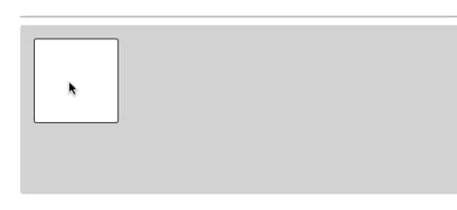

# ngx-drag-resize2 

This library is a fork of the [ngx-drag-resize](https://github.com/dmytro-parfenov/ngx-drag-resize) library by dmytro-parfenov

The project contains Angular library [ngx-drag-resize](https://www.npmjs.com/package/ngx-drag-resize2) that provides opportunity to use drag and resize functionality on HTML element

# Demo

[Live Demo here](https://ngx-drag-resize2.web.app/)

# Getting Started

## Structure

Repository contains two projects

 - [ngx-drag-resize](https://github.com/bartadaniel/ngx-drag-resize2/tree/main/projects/ngx-drag-resize) - library source code
 - [ngx-drag-resize-demo](https://github.com/bartadaniel/ngx-drag-resize2/tree/main/projects/ngx-drag-resize-demo) - used for testing the library and provides demo application 

## Development

Run `npm run start:lib` for a build library. The library will automatically rebuild if you change any of the source files from [ngx-drag-resize](https://github.com/bartadaniel/ngx-drag-resize2/tree/main/projects/ngx-drag-resize).

Run `npm run start:demo` for a dev server. Navigate to `http://localhost:4200/`. The app will automatically reload if you change any of the source files from [ngx-drag-resize-demo](https://github.com/bartadaniel/ngx-drag-resize2/tree/main/projects/ngx-drag-resize-demo).

It is necessary to run `npm run start:lib` before `npm run start:demo` to ensure that library has already built before the demo application will run.

## Running unit tests

Run `npm run test:lib` to execute the unit tests via [Karma](https://karma-runner.github.io) for the library.

Run `npm run test:demo` to execute the unit tests via [Karma](https://karma-runner.github.io) for the demo application.

## Build

Run `npm run build:lib:prod` to make a production build of the library. The build artifacts will be stored in the `dist/ngx-drag-resize` directory.

Run `npm run build:demo:prod` to make a production build of the demo application. The build artifacts will be stored in the `dist/ngx-drag-resize-demo` directory.

## Documentation

Run `npm run docs:lib` to build the documentation for the library. The build artifacts will be stored in the `docs` directory.

## Contributing

[Contributing guideline](CONTRIBUTING.md)
